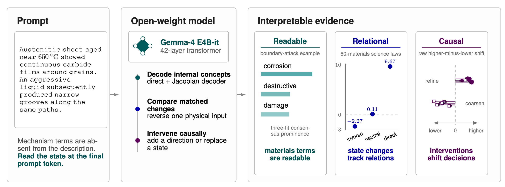
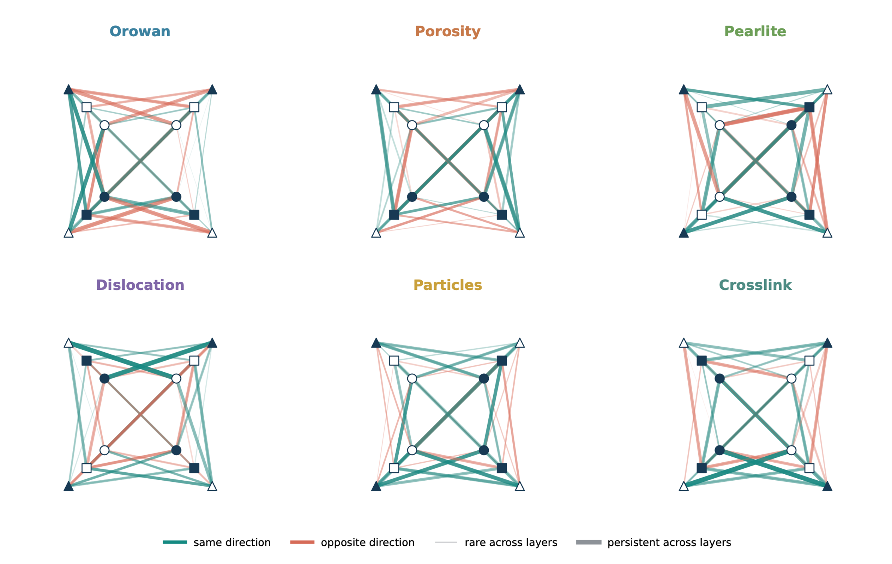
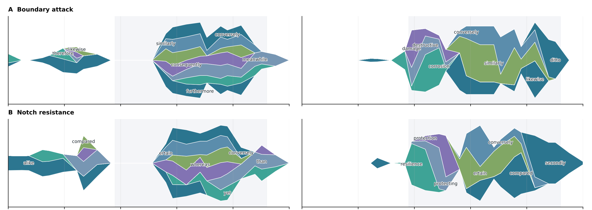

# Reading and Steering Materials Science-Mechanism Representations in an Open-Weight Language Model

Research code and data for **“Reading and Steering Materials
Science-Mechanism Representations in an Open-Weight Language Model.”** This
release applies the [Jacobian Lens](https://github.com/lamm-mit/jacobian-lens)
to open-weight Hugging Face language models, with materials-science experiments
for readable concepts, relational state changes, and causal interventions.

The repository contains the implementation, registered prompts, experiment
scripts, tests, and documentation needed to run the study. The selected
overview figures below are included for orientation; model weights, fitted
lenses, caches, raw run records, and generated reports are not distributed
here.




## 🤗 Hugging Face resources

Companion Hugging Face repositories provide the reusable fitted artifacts and
machine-readable datasets that are intentionally kept outside this source-only
GitHub release:

- [`lamm-mit/gemma4-jacobian-lenses`](https://huggingface.co/lamm-mit/gemma4-jacobian-lenses):
  the three independently fitted paper-protocol Jacobian lens checkpoints for
  `google/gemma-4-E4B-it` (seeds 0–2), together with provenance sidecars that
  record the corresponding fit and model metadata.
- [`lamm-mit/gemma4-materials-latent-vectors`](https://huggingface.co/datasets/lamm-mit/gemma4-materials-latent-vectors):
  the extracted residual-stream and Jacobian-transported state arrays used in
  the held-out latent-geometry analyses, plus the frozen prompt manifest,
  extraction metadata, and analysis protocol.
- [`lamm-mit/gemma4-materials-mechanism-prompts`](https://huggingface.co/datasets/lamm-mit/gemma4-materials-mechanism-prompts):
  the exact materials-mechanism prompt corpus organized as 21 named dataset
  configurations, with registered split metadata, a release manifest, and a
  prompt-reuse map separating development, evaluation, falsification, and
  exploratory cohorts.



The method allows us to visualize the internal representations of many materials-science prompts, revealing how they move through Gemma’s internal representation space across model depth. Each trajectory is derived from real hidden states projected into three dimensions; together, they reveal the evolving geometry of scientific information processing.  


## What is included

- `jlens_materials/*.py`: fitting, readout, analysis, reporting, comparison,
  animation, and causal-swap tools.
- `jlens_materials/prompts/`: frozen evaluation manifests plus small mechanics
  and materials examples.
- `jlens_materials/experiments/`: frozen protocols and exact prompt manifests
  for the paper's later relational, robustness, and intervention studies.
- `jlens_materials/scripts/`: experiment-specific generators, runners,
  analyses, audits, and figure builders used by the study.
- `jlens_materials/_vendor_jlens/`: the Apache-2.0 Jacobian Lens runtime needed
  for a self-contained installation.
- `tests/`: offline tests for protocols, reporting, Hub artifact handling, and
  interventions.

The package does **not** expose or reconstruct a model's private chain of
thought. Its vocabulary readouts and state interventions are measurements of
model activations and behavior.



## Installation

Python 3.10 or newer is required; Python 3.11 is the reference environment.

### Virtual environment

```bash
python3.11 -m venv .venv
source .venv/bin/activate
python -m pip install --upgrade pip
python -m pip install -e ".[experiments,dev]"
```

Install the optional hosted-analysis clients only if you will use
`jlens-analyze` with OpenAI or Anthropic:

```bash
python -m pip install -e ".[analysis,experiments,dev]"
```

### Conda

```bash
conda env create -f environment.yml
conda activate substrates-jlens
```

Gemma checkpoints may be gated. Accept the model's license and authenticate
with Hugging Face before loading `google/gemma-4-E4B-it`. A TeX distribution is
needed only for PDF compilation; Markdown and `.tex` report generation work
without it.

## Validate the installation

These checks are offline after installation:

```bash
python -m pytest -q
python -m pip check
jlens-run --help
```

## Small demonstration

The following command downloads GPT-2, fits an eight-record demonstration lens,
and evaluates the non-chat mechanics examples. It is a software smoke test, not
a reproduction of the paper's Gemma results.

```bash
jlens-run \
  --model gpt2 \
  --lens jlens_materials/lenses/gpt2-demo.pt \
  --fit --recipe demo \
  --corpus builtin --n-fit 8 --fit-max-seq-len 64 \
  --prompts jlens_materials/prompts/mechanics-paper-example.json \
  --shapes MULTIHOP,ASSOCIATION,RECOGNITION \
  --generation-max-new-tokens 1 \
  --tag gpt2-demo
```

Generated outputs are written below `jlens_materials/` and ignored by Git.
Fitting cost grows quickly with model width because each corpus record requires
multiple backward passes.

## Paper-protocol workflow

Paper mode fixes 1,000 independent 128-token fitting records, the penultimate
target layer, 25 evenly spaced report layers, strict prompt checks, a fixed
depth band, and at least 50 independent evaluation items per distribution. Pin
both the model and dataset revisions for a new quantitative run:

```bash
jlens-run \
  --model google/gemma-4-E4B-it \
  --model-revision MODEL_COMMIT_OR_TAG \
  --lens jlens_materials/lenses/gemma4-e4b-it-paper.pt \
  --fit --recipe paper \
  --corpus wikitext \
  --corpus-revision DATASET_COMMIT_OR_TAG \
  --dtype bfloat16 --dim-batch 16 \
  --workspace-band 38,92 \
  --prompts jlens_materials/prompts/materials-heldout-v1-preregistered.json \
  --shapes ASSOCIATION \
  --generation-max-new-tokens 1 \
  --tag gemma4-e4b-it-heldout-v1
```

This is a compute-intensive workflow. The resulting `.pt` file receives a
`.pt.meta.json` sidecar containing the model, tokenizer, corpus, layer, recipe,
and content-hash provenance. A lens without that sidecar cannot be used for a
paper-protocol claim.

The main frozen prompt manifests are:

- `materials-heldout-v1-preregistered.json`: 50 held-out descriptions across
  ten materials-mechanism families.
- `materials-paper-v2-preregistered.json`: the registered association and
  directed-modulation suite.
- `materials-mechanism-name-v1.json`: mechanism-word versus eponym controls.
- `materials-qualitative-pack.json`: 14 controlled examples for close
  inspection; intentionally too small for population-level claims.
- `mechanics-paper-example.json`: compact schema examples spanning lens
  evaluation, directed modulation, probe swaps, and verbal-report swaps.

See [`jlens_materials/prompts/README.md`](jlens_materials/prompts/README.md) for
the JSON schema and [`jlens_materials/README.md`](jlens_materials/README.md) for
the CLI and output conventions.

Later experiments keep their frozen `protocol.json`, `prompt_manifest.json`,
preregistration, amendment, and protocol documentation beside the paths used by
the corresponding scripts under `jlens_materials/experiments/`. Raw model
outputs, state arrays, statistics, and rendered figures are deliberately absent.
The [experiment index](jlens_materials/experiments/README.md) maps each released
study to its frozen inputs and reproduction commands.

### Reproducing experiment analyses

Run study scripts from the `jlens_materials` directory because their frozen
paths are relative to that directory:

```bash
cd jlens_materials
python scripts/run_lexical_adversarial_representation.py --help
```

Runner scripts recreate raw model outputs and state arrays; analyzer and plot
scripts consume those generated files. The source-only repository therefore
supports a fresh execution but does not make archived-data-only analyzers run
before their prerequisite runner has completed. See each experiment README for
the required order. Use `MPLCONFIGDIR` to choose a writable Matplotlib cache on
restricted or headless systems.

## Optional analysis and reports

Run records can be analyzed offline or with a hosted model:

```bash
jlens-analyze --run jlens_materials/runs/RUN.json --offline
jlens-report-md --run jlens_materials/runs/RUN.json
jlens-report --run jlens_materials/runs/RUN.json --no-compile
```

For hosted analysis, set `OPENAI_API_KEY` or `ANTHROPIC_API_KEY` in the process
environment. Credentials are never required for fitting or offline analysis
and must not be written into prompt, run, or lens metadata.

## Reproducibility boundaries

- The released prompts and scripts are source inputs; checkpoints and generated
  observations must be recreated or obtained separately under their own terms.
- A Gemma run applies the registered method but does not reproduce results from
  a different model family.
- `--recipe demo` is exploratory. Only complete `--recipe paper` runs with
  verified provenance and satisfied sample thresholds are quantitative.
- Multi-token concepts are not silently approximated by a single token; the
  run record reports them as dropped where appropriate.
- Model and dataset licenses apply independently of this repository's license.

## Citation and license

Citation metadata is in [`CITATION.cff`](CITATION.cff). The repository is
licensed under Apache License 2.0; see [`LICENSE`](LICENSE) and [`NOTICE`](NOTICE)
for the vendored Jacobian Lens attribution.

## Paper citation

The arXiv identifier has not yet been assigned. Until it is available, cite the
preprint as follows:

```bibtex

@misc{buehler2026readingsteeringrepresentationsmaterialsscience,
      title={Reading and Steering Representations of Materials-Science Mechanisms in an Open-Weight Language Model}, 
      author={Markus J. Buehler},
      year={2026},
      eprint={2607.20058},
      archivePrefix={arXiv},
      primaryClass={cs.AI},
      url={https://arxiv.org/abs/2607.20058},
}
```